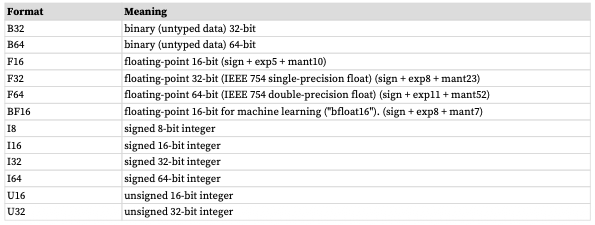
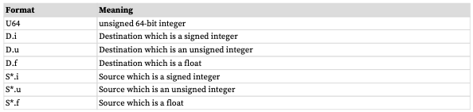
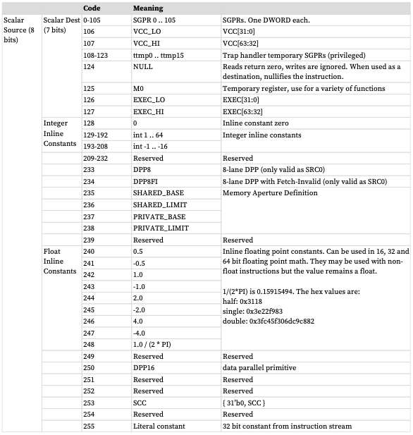
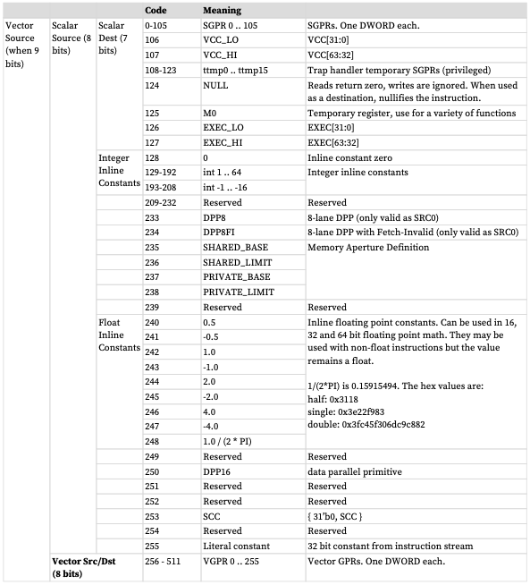

# RDNA3 Subset

## Summary

- **VGPRs:** 32-bit, 32-wide, 32 registers
- **SGPRs:** 32-bit
- **LDS (Local Data Store):** 32-bank scratch memory allocated to waves. (128kB)

SIMD Unit = Vector ALU (processes instructions for a single wave(front))

A Compute Unit, contains 2 SIMD32s, with a single path to memory.

Each wave has an EXEC mask (which lanes/threads/work-items are active and not).

Vector memory instructions transfer data between VGPRs and memory. Each work-item supplies its own
memory address and supplies or receives unique data. These instructions are also subject to the EXEC mask.

Initally we don't support 64-wide vector instructions, only 32-wide ones.

### Data Types

- DWORD = 32-bit data
- SHORT = 16-bit data
- BYTE = 8-bit data

### Instruction Suffixes





## Wave State

- PC (48 bits), 2 LSBs are forced to 0.
- V0-V255 (VGPRs) (32 bits) - 32 bits per work-item, with 32 work-items per wave.
- S0-S105 (SGPRs) (32 bits) - All waves are allocated 106 SGPRs and 16 TTMPs (Trap Temporary SGPRs).
- EXEC Mask (64 bits) - one bit per thread, applied to vector instructions.
- VCC (Vector Condition Code, 64 bits) one per thread, to hold the result of a vector compare operation or integer carry out.
- SCC (Scalar Condition Code, 1 bit) - Result from a scalar ALU comparison inst.

SCC set when:
  - Compare Operations: 1 = true
  - Arithmetic Operations: 1 = carry out
  - Bit/Logical Operation: 1 = result was not zero
  - Move: No effect on SCC

## SGPRs



## VGPRs




## Litmus Test-Based Subset

### add_one.asm

```asm
v_mov_b32 v5, 123
v_add_u32 v5, 1, v5
v_mov_b32 %0, v5
```